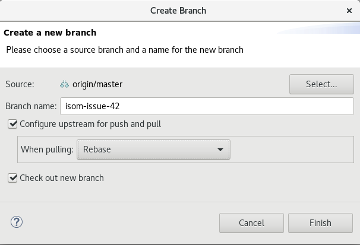
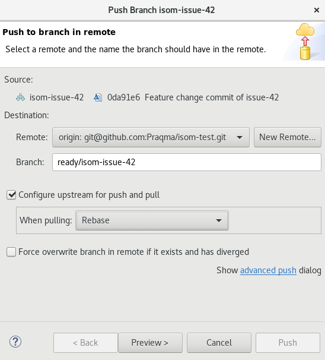
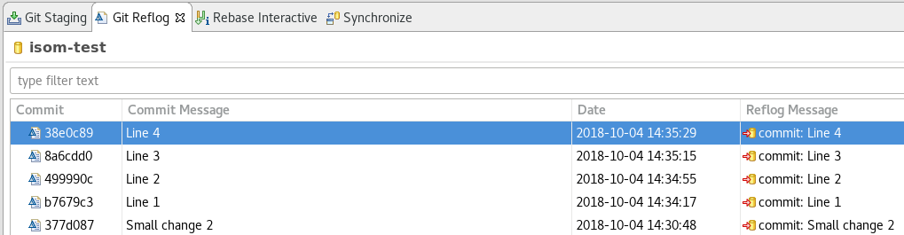
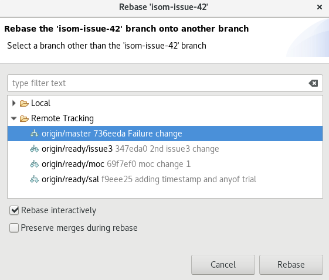
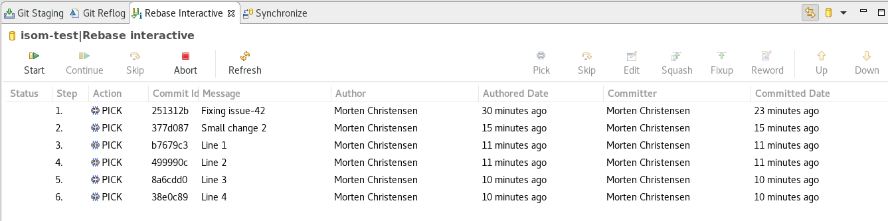
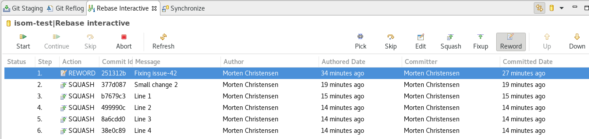
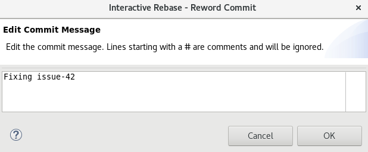
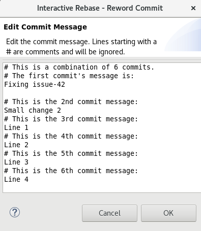
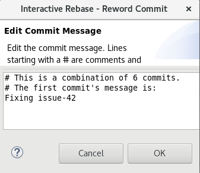

# Pretested using Eclipse and the EGit plugin

## Prerequisites
* Working instance of [Eclipse IDE](http://www.eclipse.org/downloads/packages/installer) - Luna Release (4.4) or later. This guide is tested with Photon Release (4.8)
* Local installation of [Git command line tools](https://git-scm.com/downloads)
* [EGit](http://www.eclipse.org/egit/) plugin installed and setup.

For assistance with installing EGit with Eclipse please consult section 2 of this [Eclipse (EGit) Tutorial](https://www.javacodegeeks.com/2018/03/git-version-control-with-eclipse-egit-tutorial.html)
- - -
## Setup
* Add the `Git Staging` view to your current perspective

## As a developer
- - -
### Fetch and Deliver changes
* Checkout the branch that you eventually will integrate your changes with - Usually the _master branch_
    - Right-click the project and select Team -> Switch To -> master
* Rebase the local master branch onto the remote
    - Right-click the project and select Team -> Pull...
    - In the wizard check that reference is `master` and 'When pulling' is `Rebase`
    - A Window displays the pull result - Examine it as you wish and select `Close`
* Checkout new branch
    - Right-click the project and select Team -> Switch To -> New Branch
    - Source: `origin/master`
    - Branch name: _Your branch name describing the change i.e. issue key_
    - Check `Configure upstream for push and pull`
    - Select When pulling: `Rebase`
    - Check `Check out new branch`

        

* Work on your changes and continue when you are ready to publish
* Stage and commit your changes when they are ready to integrate
    - The `Git Staging` view will provide an overview of your changes and their stage status (staged/unstaged). If the view is not populated, check that the correct repository is selected in the `Switch repository` pull down menu
    - Either click the multi plus sign to stage all changes or select the changes you wish to include and click the mono plus sign
    - Confirm in the `Staged Changes` area that these are the changes you with to commit
    - Write a good commit message and push `Commit` - Do **not** push just yet
* Pull the latest changes from master
    - Right-click the project and select Team -> Pull
    - A window displays the result - Examine it and select `Close`
* Push the changes to `remote`
    - Right-click the project and select Team -> Push Branch 'branch name'... - The `Push Branch` wizard opens
    - Assuming your local branch is called `issue-42` in the Branch field write `ready/issue-42`
    - Select `Preview >` and verify the intended push operation
    - Select `Push` then review and close the confirmation window

        

You have now delivered the changes to the pretested-integration process, and the CI server will soon kick in and start to work on the integration (merge, build, test, validate).

**Note:** The changes will not be pushed to `master` until this process is complete, so if you immediately switch to master and pull changes, chances are that your recently pushed changes will still not be there. Do not worry however, unless you depend on your recent changes, the later rebase operation will make sure your are up to date with `master`.
- - -
### Integration failed
* Checkout your failed branch by
  - Open the `branches` dialog
  - Select the failing branch under local and choose `Check Out`
  
* Replay your work on top of master to get the issues/conflicts by
  - Right-click the project and select Team -> Pull
  - A window displays the result - Examine it and select `Close`
* Fix the problem - solve the merge conflicts

* Rebase the changes by following the guide under [One commit push](#One-commit-push) - **Do not push yet**

* Delete the old pushed branch by
  - Open the `branches` dialog
  - Select the remote branch e.g. `ready/isom-issue-42`
  - Choose `Delete` and accept the warning to delete it even if it has not been merged to master

* Push the local branch with the resolved merge conflicts by following the last part of the guide under [One commit push](#One-commit-push)
- - -
### One commit push
To keep the commit history clean and precise, it is recommended to `squash` multiple commits which are all related to the same change

* Consult the `Git Reflog` view to get an overview of the commits you have accumulated during your work with an issue
       
    

* Rebase your changes with the latest changes on master
    - Right-click the project and select Team -> Rebase... - The Rebase wizard opens
    - Select `origin/master` as the rebasing branch
    - Check `Rebase interactively` if you wish to i.e. squash your commits (recommended)
    - Leave `Preserve merges during rebase` unchecked

        

    - Go to the `Rebase interactive view` and perform the desired rebase actions

        

      - `Reword` the first commit message to match the entire change, i.e. _Feature issue-42_
      - `Squash` the rest of the commits, making all the committed changes into one with the message above

        

      - Select `Start`
      - Edit the commit message and make sure to mention the issue key

        

      - Now edit the rest of the commit message, probably by just deleting the following messages

        

        
      - Select OK
* Push the changes to `remote`
    - Right-click the project and select Team -> Push Branch 'branch name'... - The `Push Branch` wizard opens
    - Assuming your local branch is called `issue-42` in the Branch field write `ready/issue-42`
    - Select `Preview >` and verify the intended push operation
    - Select `Push` then review and close the confirmation window

        
- - -
### Clean up
* Clean up all local merged branches by
  - Open the `branches` dialog
  - Select the branches you want to delete
  - Select `Delete`

**Note:** You cannot delete a branch that is currently checked out
